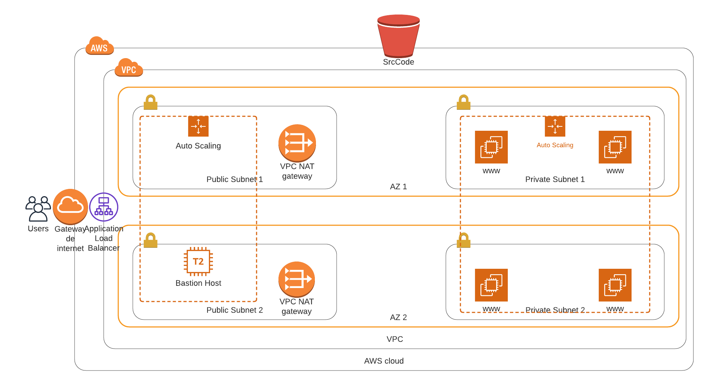

# Deploy a High-Availability Web App Using CloudFormation
This CloudFormation Scripts deploys 1 VPC (Virtual Private Cloud) across 2 AZs (Availability Zones), each AZ has 2 subnets, 1 public and 1 private. 

It also deploys 2 AutoScaling Groups, 1 that is reponsible for maintain a WebApp that has 4 EC2 instances, each 2 of them hosted in 1 of the private subnets, another AutoScaling Group is reponsible for maintain a bastion host in 1 of the public subnets so we can use it as a jump host to access the WebApp servers for troubleshotting.

It contains 2 NAT Gateways, each one in one of the public subnets, so the WebApps can fetch updates properly from the Internet, it also implements a Load Balancer that distribute the load across the multiple servers and an Internet Gateway.

Last but not least it deploys a S3 bucket and a proper role, policy and IAM Profile so the EC2 instances can fetch (read and list) source code or information from that bucket, when the EC2 instances is provisioned it installs the AWS CLI, Apache and put some info into `index.html`.


## Files

  * cloudformation.sh
  * diagram.png
  * final-project.yml
  * parameters.json
  * printscreen.png
  * README.md

#### cloudformation.sh
This is a bash script file used to create, update or delete AWS stacks.

#### diagram.png
This file contains an overview of what's been implemented by the CloudFormation script.

#### final-project.yml
This file contains the CloudFormation script in YAML format.

#### parameters.json
Parameters used by de CloudFormation script in JSON format.

#### printscreen.png
A simple printscreen showing the WebApp up and running after provisioning in AWS.


## Instructions

1. You must have an AWS account and [AWS CLI](https://docs.aws.amazon.com/cli/latest/userguide/cli-chap-install.html) proper setup.
2. Change the parameters in `parameters.json` as you wish, specially the one called `KeyName` to match the parameter name you configured in your [parameter store](https://docs.aws.amazon.com/AWSCloudFormation/latest/UserGuide/parameters-section-structure.html) to reference the name of the Key Pair used to SSH into EC2 instances:
3. Search for the below comment in `final-project.yml` to update the reference to you current [public IP](https://www.whatsmyip.org/) address:

    ```
    #Change to your current public IP address
    CidrIp: 201.24.40.132/32
    ``` 
4. To avoid costs consider changing in `final-project.yml` as mentioned in the comment below:
    ```
    #When testing change InstanceType to t2.micro to avoid costs!
    InstanceType: t3.medium
    ```
5. Consider commenting out sessions related to KeyName, Bastion and SSH port 22 if you want remote access to the environment.
6. Run the script passing as parameters the name of the stack and the action ( create | update | delete ) like the example below:
    ```
    ./cloudformation.sh MyStackTest create
    ```
7. You can test if the application is up and running accessing the URL of the Load Balancer that is outputed when the stack is created.
8. Have fun! :)


## Diagram

